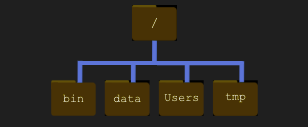

# Command Lines

---

## What is a Shell?

Humans and computers commonly interact in many different ways, such as through a keyboard and mouse, touch screen interfaces, or using speech recognition systems. The most widely used way to interact with personal computers is called a graphical user interface (GUI). With GUI, we give instructions by clicking a mouse and using menu-driven interactions.

While the visual aid of a GUI makes it intuitive to learn, this way of interacting scales very poorly with some tasks.

A **command-line interface (CLI)** allows users to interact with a computer by reading and writing text. It excels at making repetitive tasks automatic and fast.

A **shell** is a particular program that lets you type commands. We'll be using "Bash" which is the most popular Unix Shell to learn the CLI commands. Bash is often the default shell on Unix and in Unix-like tools for Windows.

### Why use the shell?

The shell can be used for simple tasks like creating an empty folder and for launching (even complex) programs with a single command. In fact, some tools are resources such as cloud computing systems usually require users to be familiar with the shell. Shell commands can be combined and saved into reproducible scripts that automate repetitive tasks.

Using the shell will take some effort and some time to learn. While a GUI presents you with choices to select, CLI choices are not automatically presented to you. It can be daunting at first, but once you've come familiar with this different style of interacting, you will be able to efficiently accomplish a huge variety of tasks.

#### Let's get started

When the shell is first opened, you are represented with a **prompt**, indicating that shell is waiting for input.

The shell typically uses **$** as the prompt, but may use a different symbol. 

Note that some prompt might look a little different. In particular, most popular shell environment by default put your username and the host name before the $. 

Basic command lines table:

| CLI Command | Action |
| ----------- | ------ |
| ls | This command will list the contents of the current directory |
| ls -F | **-F option** tells **ls** to classify the output by adding a marker to file and directory names to indicate what they are. a) a trailing **/** indicates that this is a directory b) **@** indicates a link c) **\*** indicates an executable |
| pwd | Stands for '**print working directory**'. Shows current working directory |
| clear | Clears the terminal. |
| clear -x | Clears the terminal and still allows access to previous commands by using the up and down arrow key |
| 

---

# Exercise 

To practice using the CLI commands, we're going to follow an exercise provided in the Unix Shell course designed by the Software Carpentry Foundation.

The resources we'll be using has been unzipped and added to the project folder at OdinProjectFoundations/shell-lesson-data

**Nelle’s Pipeline: A Typical Problem**
Nelle Nemo, a marine biologist, has just returned from a six-month survey of the North Pacific Gyre, where she has been sampling gelatinous marine life in the Great Pacific Garbage Patch. She has 1520 samples that she’s run through an assay machine to measure the relative abundance of 300 proteins. She needs to run these 1520 files through an imaginary program called goostats.sh. In addition to this huge task, she has to write up results by the end of the month, so her paper can appear in a special issue of Aquatic Goo Letters.

If Nelle chooses to run goostats.sh by hand using a GUI, she’ll have to select and open a file 1520 times. If goostats.sh takes 30 seconds to run each file, the whole process will take more than 12 hours of Nelle’s attention. With the shell, Nelle can instead assign her computer this mundane task while she focuses her attention on writing her paper.

The next few lessons will explore the ways Nelle can achieve this. More specifically, the lessons explain how she can use a command shell to run the goostats.sh program, using loops to automate the repetitive steps of entering file names, so that her computer can work while she writes her paper.

As a bonus, once she has put a processing pipeline together, she will be able to use it again whenever she collects more data.

In order to achieve her task, Nelle needs to know how to:

- navigate to a file/directory
- create a file/directory
- check the length of a file
- chain commands together
- retrieve a set of files
- iterate over files
- run a shell script containing her pipeline

---

## File System Structure

  

The filesystem looks like an upside down tree. The topmost directory is the **root directory** that holds everything else. We refer to it using a slash character, **/**, on its own; this character is the leading slash in **/Users/JohnDoe**.

Inside that directory are several other directories: **bin** (which is where some built in programs are stored), **data** (for miscellaneous data files), **Users** (where users' personal directories are located), **tmp** (for temporary files that don't need to be stored long-term), and so on.

We know that our current working directory **/Users/JohnDoe** is stored inside **/Users** because **/Users** is the first part of its name. Similarly, we know that **/Users** is stored inside the root directory **/** because the name begins with **/**.