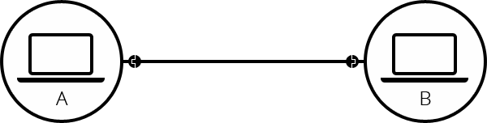
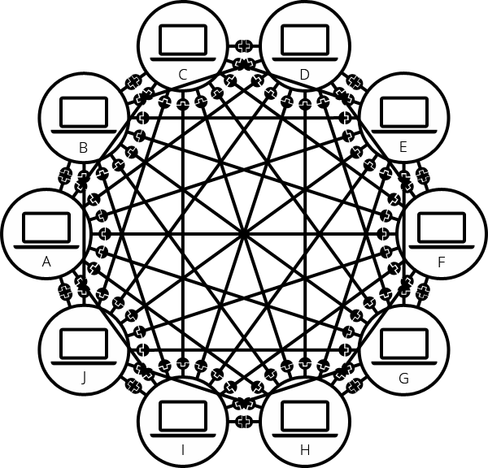

# How Does the Web Work?

---

## How does the Internet work?

The **Internet** is the backbone of the Web, the technical infrastructure that makes the Web possible. At its most basic, the Internet is a large network of computers which communicate all together.

The history of the Internet is somewhat obscure. It began in the 1960s as a US-army-funded research project (Development of the first Internet, ARPANET), then evolved into a public infrastructure in the 1980s with the support of many public universities and private companies. The various technologies that support the Internet have evolved over time, but the way it works hasn't changed that much: Internet is a way to connect computers all together and ensure that, whatever happens, they find a way to stay connected.

**Aaron Titus's Internet explained in 5 minutes.**

 

---

### A simple network

When two computers need to communicate, you have to link them, either physically (usually with an Ethernet cable) or wirelessly (for example with Wi-Fi or Bluetooth systems). All modern computers can sustain any of those connections.

  

Such a network is not limited to two computers. You can connect as many computers as you wish. But it gets complicated quickly. If you're trying to connect, say, ten computers, you need 45 ables, with nine plugs per computer!

 

  

To solve this problem, each computer on a network is connected to a special tiny computer called a **network switch** (or switch for short). The single purpose of the switch is to make sure that messages sent from a given computer arrive only at their target destination computer. To send a message to computer B, computer A sends the message to the switch, which in turn forwards the message to computer B, computer B doesn't get messages intended for other computers, and none of the messages for computer B reach other computers on the local area network.

Once we add a switch to the system, our network of computers only require 10 cables: a single plug for each computer and a switch with 10 plugs (This is much more manageable).

---

## Browsing the Web
### The difference between web pages, website, web server, and search engine

We will start by describing various web-related concepts: web pages, websites, web servers, and search engines. 

**Web page**
    A document that can be displayed in a web browser. These are also often called just "pages". Such documents are written in the HTML language.

**Website** 
    A collection of web pages grouped together into a single resource, with links connecting them together. Often called a "site".

**Web server**
    A computer that hosts a website on the Internet. Think of it as a big computer that is directly connected to the Internet.

**Web service**
    A software responds to requests over the Internet to perform a function or provide data. A web service is typically backed by a web server, ad may provide web pages for users to interact with. Many websites are also web services, though some websites (such as MDN) consist of static content only. Examples of web services would be something that resizes images, provides a weather report or handles user login.

**Search engine**
    A web service that helps you find other web pages, such as Google, Bing, Yahoo, or DuckDuckGo. Search engines are normally accessed through a web browser (for example, you can perform search engine directly in the address bar of Firefox, Chrome, etc.) or through a web page (for example, bing.com or duckduckgo.com).

